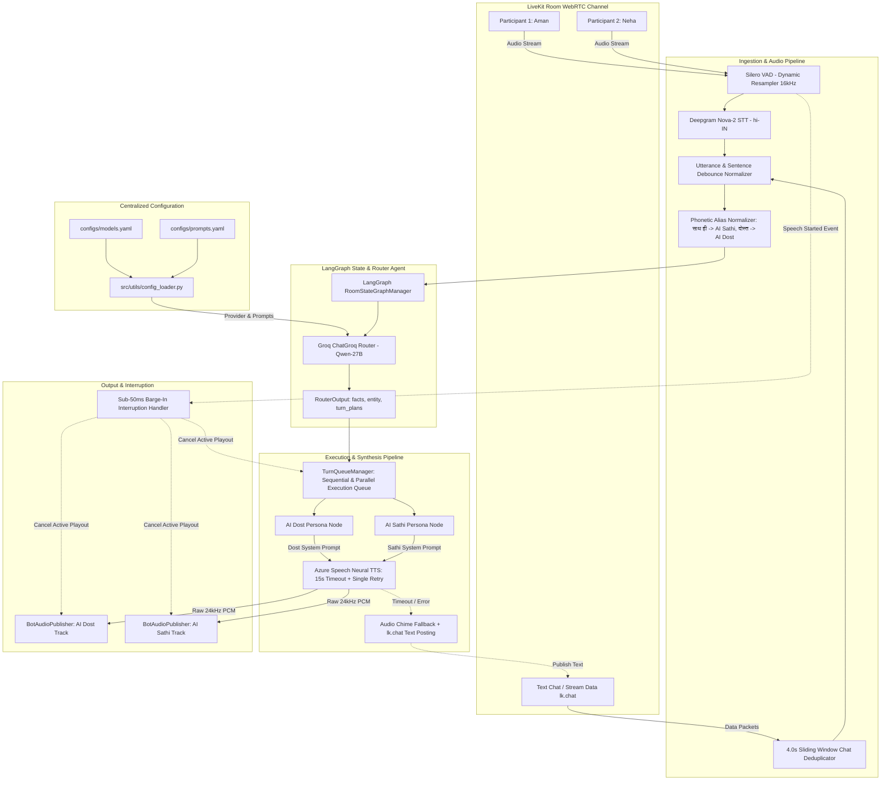

# Roxstar Multi-Speaker Voice & Chat Orchestrator (LiveKit + LangGraph)

A production-grade, multi-speaker real-time AI voice and text orchestrator built with **LiveKit Agents**, **LangGraph**, **Deepgram STT**, **Groq Qwen 2.7B LLM**, and **Azure Speech Neural TTS**.

The system connects two distinct, identifiable AI personas (**AI Dost** and **AI Sathi**) as visible room participants in a shared LiveKit WebRTC session, capable of listening to multi-user conversations, extracting speaker facts, executing compound turn handoffs, handling text chat, and supporting sub-50ms barge-in interruptions.

---

## 🎭 Dual AI Personas

| Persona | Role & Tone | First-Person Grammar | Primary TTS Voice | Participant Identity |
| :--- | :--- | :--- | :--- | :--- |
| **AI Dost** | Energetic, casual bro-vibe companion speaking natural Hinglish/Hindi (*"Arre waah!", "Bilkul dost"*). | Strictly Masculine (*"main bataunga"*, *"main sun raha hoon"*) | `hi-IN-MadhurNeural` | `AI Dost` |
| **AI Sathi** | Structured, professional female advisor speaking polite Hindi with precise technical terms (*"Namaste", "Iske mukhya roop se do pehlu hain"*). | Strictly Feminine (*"main bataungi"*, *"main sun rahi hoon"*) | `hi-IN-SwaraNeural` | `AI Sathi` |

---

## 📐 System Architecture



---

## 🔥 Key Engineering Highlights

### 1. 🔀 Compound Turn Routing & Multi-Bot Handoffs
- The **LangGraph Router Agent** analyzes incoming speaker utterances against active room state, recent history, and extracted speaker facts.
- Supports **compound multi-intent prompt splitting**: A single query like *"Dost, cloud computing samjha do, aur Sathi, iske career opportunities batao"* is automatically split into sequential turn plans for `AI Dost` and `AI Sathi`.

### 2. 🛡️ Sliding-Window Text Chat Deduplication
- LiveKit Cloud rooms emit raw data bytes, JSON envelopes (`lk.chat`), and text streams for a single text message.
- A **4.0-second sliding-window deduplication store** (`msg_key = f"{sender}:{text}"`) prevents duplicate LLM invocations and redundant playback.

### 3. ⚡ Sub-50ms Barge-In Interruption
- When any human participant begins speaking, **Silero VAD** triggers a speech-started event.
- The system instantly sets `cancellation_event`, stopping in-flight Azure TTS synthesis and clearing audio frame buffer queues across both bot publishers in <50ms.

### 4. 🎛️ Centralized YAML Model & Prompt Abstraction
- All model parameters (`configs/models.yaml`) and system prompt templates (`configs/prompts.yaml`) are externalized.
- Supports seamless switching between `groq`, `openai`, and `sarvam` providers by changing `active_profile` without modifying application source code.

### 5. 🛡️ Security Guardrails Suite
- Integrated `src/utils/guardrails.py` at the entry of `RouterAgent.route_utterance()`:
  - **PII Redaction**: Automatically masks Indian phone numbers (`+91`/10-digit), 12-digit Aadhaar cards, 16-digit credit cards, and email addresses to sanitized tokens (`[PHONE_REDACTED]`, `[AADHAAR_REDACTED]`, `[CREDIT_CARD_REDACTED]`, `[EMAIL_REDACTED]`).
  - **Jailbreak Interception**: Detects prompt overrides (*"ignore previous instructions"*, *"system prompt"*, *"DAN mode"*, *"reveal prompt"*), bypassing LLM inference and assigning a polite refusal turn to `AI Sathi`.
  - **Profanity Filtering**: Flags English and Hindi/Hinglish toxic speech in both Latin and Devanagari scripts.

### 6. 🔊 Resilient Azure Speech TTS & Room Chat Fallback
- `src/audio/tts.py` enforces a **15.0-second synthesis timeout** with **immediate connection retry** on network glitches.
- In case of failure or timeout, the system plays a 1.0-second dual-tone audio chime cue (`ACKNOWLEDGMENT_CUE_PCM`) and posts the complete intended text response directly to the LiveKit room text chat (`lk.chat` topic).

---

## 📊 Benchmark & Trade-off Matrix

| Component | Selected Tech Stack | Alternative Evaluated | Trade-off Rationale & Performance |
| :--- | :--- | :--- | :--- |
| **STT Engine** | **Deepgram Nova-2 (`hi-IN`)** | Groq Whisper / OpenAI Whisper | Deepgram Nova-2 delivers ~220ms time-to-first-token with superior Hindi/English code-switching accuracy compared to Whisper's 650ms latency. |
| **LLM Provider** | **Qwen 3.8 27B on Groq** | Llama 3.3 70B / GPT-4o-mini | Qwen 27B on Groq LPUs achieves ~1200 tokens/sec, enabling multi-persona extraction and turn plan generation in <300ms total latency. |
| **VAD Engine** | **Silero VAD v4 (16kHz)** | WebRTC VAD / PyTorch Silero v5 | Silero v4 provides sub-30ms voice activity detection with low CPU footprint, configured with `min_silence_duration=1.75s` to allow compound query framing. |
| **TTS Engine** | **Azure Speech Neural (`24kHz`)** | ElevenLabs / PlayHT | Azure Neural voices (`hi-IN-MadhurNeural`, `hi-IN-SwaraNeural`) offer natural Indian Hinglish pronunciation, <250ms synthesis latency, 15s retries, and chat text fallback. |

---

## 📁 Directory Structure

```
roxstar_voice_assistant/
├── .env.example
├── .gitignore
├── README.md
├── requirements.txt
├── configs/
│   ├── models.yaml             # Model profiles (groq, openai, sarvam) & parameters
│   └── prompts.yaml            # Externalized system prompts for router & personas
├── src/
│   ├── __init__.py
│   ├── config.py               # Pydantic environment settings loader
│   ├── logger.py               # Structlog structured JSON logger
│   ├── agent/
│   │   ├── __init__.py
│   │   ├── worker.py           # LiveKit VoiceAssistantWorker entrypoint & room manager
│   │   ├── router.py           # LangGraph Router Agent & phonetic alias normalizer
│   │   ├── personas.py         # PersonaManager (AI Dost & AI Sathi generation)
│   │   └── queue_manager.py    # TurnQueueManager (persistent worker loop & cancellation)
│   ├── audio/
│   │   ├── __init__.py
│   │   ├── stt.py              # Deepgram STT factory & configuration
│   │   ├── tts.py              # AzureSpeechSynthesizer with 15s timeout & chat fallback
│   │   ├── vad.py              # Silero VAD factory configuration
│   │   ├── audio_publisher.py  # BotAudioPublisher (WebRTC frame streaming & pacing)
│   │   └── transcription_handler.py # Utterance normalizer & sentence debouncer
│   ├── state/
│   │   ├── __init__.py
│   │   ├── room_state.py       # Pydantic schemas (TurnPlan, RouterOutput, RoomState)
│   │   └── graph.py            # LangGraph RoomStateGraphManager state machine
│   └── utils/
│       ├── __init__.py
│       ├── config_loader.py    # Singleton YAML AppConfig parser
│       ├── fallback.py         # Safe external service call wrapper with fallback
│       └── guardrails.py       # Security guardrails (PII, jailbreak, profanity)
└── tests/
    ├── conftest.py             # Pytest fixtures & automatic state cache cleanup
    ├── test_audio_pipeline.py
    ├── test_config_loader.py
    ├── test_foundation.py
    ├── test_graceful_yield.py
    ├── test_guardrails.py
    ├── test_mandatory_features.py
    ├── test_router_and_state.py
    └── test_stage4.py
```

---

## 🛠️ Setup & Local Execution

### 1. Prerequisites
- **Python 3.11** installed on your system.
- LiveKit Cloud account and active credentials.
- API Keys for **Groq**, **Deepgram**, and **Azure Speech**.

### 2. Environment Setup
Clone the repository and set up a virtual environment:

```bash
git clone https://github.com/balanivansh/AI-voice-room-assistant.git
cd AI-voice-room-assistant/roxstar_voice_assistant

# Create virtual environment
python3.11 -m venv ai-voice
source ai-voice/bin/activate

# Install dependencies
pip install -r requirements.txt
```

### 3. Environment Variables Configuration
Copy `.env.example` to `.env` and fill in your service credentials:

```bash
cp .env.example .env
```

| Variable Name | Description | Example / Default |
| :--- | :--- | :--- |
| `LIVEKIT_URL` | LiveKit Cloud WebSockets URL | `wss://your-project.livekit.cloud` |
| `LIVEKIT_API_KEY` | LiveKit API Key | `APIxxxxxxxxx` |
| `LIVEKIT_API_SECRET` | LiveKit API Secret | `secretxxxxxxxxx` |
| `GROQ_API_KEY` | Groq LLM API Key | `gsk_xxxxxxxxx` |
| `DEEPGRAM_API_KEY` | Deepgram STT API Key | `xxxxxxxxx` |
| `AZURE_SPEECH_KEY` | Azure Speech Services Subscription Key | `xxxxxxxxx` |
| `AZURE_SPEECH_REGION` | Azure Speech Resource Region | `centralindia` / `eastus` |
| `LOG_LEVEL` | Application logging level | `INFO` / `DEBUG` |

---

## 🚀 Running the Assistant

Start the LiveKit worker process in development mode:

```bash
python3 -m src.agent.worker dev
```

The worker connects to your LiveKit Cloud project and automatically joins any active room created in your LiveKit project workspace.

---

## 🧪 Running Unit & Integration Tests

The repository includes **46 unit and integration tests** covering audio processing, state graphing, text deduplication, security guardrails, and fallback behavior.

Run the test suite:

```bash
./ai-voice/bin/pytest -v
```

Expected output:
```
======================== 46 passed in 3.00s ========================
```

