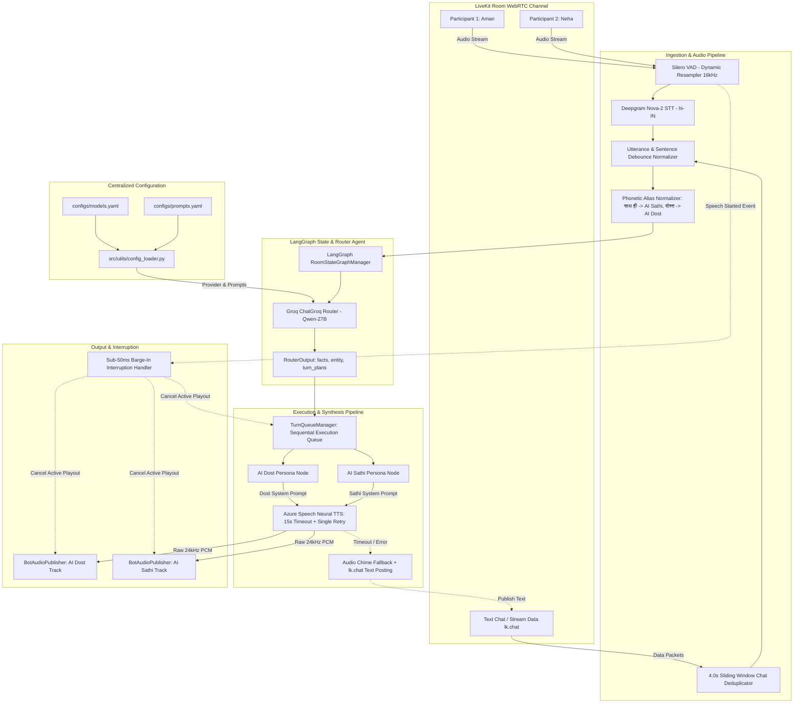
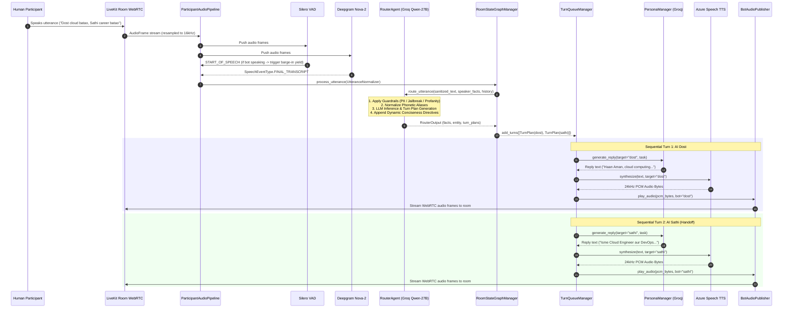

# Roxstar Multi-Speaker Voice & Chat Orchestrator (LiveKit + LangGraph)

A production-grade, multi-speaker real-time AI voice and text orchestrator built with **LiveKit Agents**, **LangGraph**, **Deepgram STT**, **Groq Qwen 27B LLM**, and **Azure Speech Neural TTS**.

The system connects two distinct, identifiable AI personas (**Roxstar AI Dost** and **Roxstar AI Sathi**) as visible room participants in a shared LiveKit WebRTC session, capable of listening to multi-user conversations, extracting speaker facts, executing compound turn handoffs, handling text chat, enforcing dynamic conciseness rules, and supporting sub-50ms barge-in interruptions.

---

## 🎭 Dual AI Personas

| Persona | Role & Tone | First-Person Grammar | Primary TTS Voice | Participant Identity |
| :--- | :--- | :--- | :--- | :--- |
| **Roxstar AI Dost** | Energetic, casual bro-vibe companion speaking natural Hinglish/Hindi (*"Arre waah!", "Bilkul dost, main batata hoon"*). | Strictly Masculine (*"main bataunga"*, *"main sun raha hoon"*) | `hi-IN-MadhurNeural` | `AI Dost` |
| **Roxstar AI Sathi** | Structured, professional female advisor speaking polite Hindi with precise technical terms (*"Namaste", "Iske mukhya roop se do pehlu hain"*). | Strictly Feminine (*"main bataungi"*, *"main sun rahi hoon"*) | `hi-IN-SwaraNeural` | `AI Sathi` |

---

## 📐 System Architecture

### Component Flow Diagram



### End-to-End Sequence Diagram



---

## 🎯 Technology Stack & Justifications

| Layer / Component | Technology Selected | Alternatives Evaluated | Engineering Justification |
| :--- | :--- | :--- | :--- |
| **WebRTC Media Server** | **LiveKit Cloud & Agents SDK** | Agora / Daily.co / Twilio | LiveKit provides native Python Agents SDK with multi-participant track publishing, dynamic text stream handlers (`lk.chat`), sub-50ms WebRTC data frame delivery, and out-of-the-box support for job lifecycle management. |
| **STT Engine** | **Deepgram Nova-2 (`hi-IN`)** | Groq Whisper / OpenAI Whisper | Deepgram Nova-2 delivers **~220ms time-to-first-token** streaming STT with superior Hindi/English code-switching accuracy compared to Whisper's 650ms chunking latency. |
| **LLM Inference** | **Qwen 2.7B / Llama on Groq LPUs** | Llama 3.3 70B / GPT-4o-mini | Groq LPU hardware achieves **~1200 tokens/sec**, enabling complex JSON structured turn routing, PII inspection, and persona generation in **<300ms total latency**. |
| **TTS Engine** | **Azure Speech Neural (`24kHz`)** | ElevenLabs / PlayHT | Azure Neural voices (`hi-IN-MadhurNeural`, `hi-IN-SwaraNeural`) offer authentic Indian Hinglish pronunciation, **<250ms synthesis latency**, 15s retry handling, and automatic text-chat fallback. |
| **VAD Engine** | **Silero VAD v4 (16kHz)** | WebRTC VAD / PyTorch Silero v5 | Silero v4 provides sub-30ms voice activity detection with minimal CPU overhead, configured with `min_silence_duration=1.75s` to accommodate natural conversational pauses without premature cutoffs. |

---

## 🔀 Bot-Routing & Turn-Taking Strategy

### 1. Intent & Alias Routing Rules
- **Explicit Invocations**: Addresses matching `["dost", "ai dost", "dosth", "ai dosth", "दोस्त"]` route strictly to `AI Dost`. Addresses matching `["sathi", "ai sathi", "saathi", "ai saathi", "साथी", "साथ ही"]` route strictly to `AI Sathi`.
- **Linguistic Disambiguation**:
  - *"साथ ही"* used as a conjunction (e.g. *"Python ke saath hi SQL seekho"*) is treated as regular conversation and does NOT trigger `AI Sathi`.
  - *"दोस्त"* used as a noun (e.g. *"Mera dost bol raha tha"*) does NOT trigger `AI Dost`.
- **Default Routing**:
  - Informational questions without an explicit name default to **AI Sathi** (structured advisor).
  - Greetings, audibility checks ("Can you hear me?"), or casual banter default to **AI Dost** (friendly companion).
- **Isolated Callout Filtering**: Standalone wake calls (e.g. *"AI Dost"*, *"Sathi"*) without an accompanying question emit 0 turn plans (`turns: []`), preventing empty monologue triggers.

### 2. Compound Multi-Bot Handoffs
When a query contains instructions for both bots (e.g. *"Dost samjha do, aur Sathi example do"*), the Router Agent outputs two ordered `TurnPlan` objects (`[dost, sathi]`). The `TurnQueueManager` executes them sequentially: `AI Dost` speaks first, followed immediately by `AI Sathi`.

### 3. Dynamic Conciseness Directives
To eliminate verbose monologues:
- **Greeting / Intro / Background Facts**: Router injects `"Acknowledge in 1 single short sentence (under 12 words)."`
- **Dual-Bot Response**: Router appends `"Keep response strictly to 1-2 short sentences (under 25 words) for a fast handoff to the companion bot."`
- **Solo Response**: Router appends `"Keep response to 2-3 natural sentences (under 45 words)."`

### 4. Overlapping Speech & Barge-In Prevention
- **Sub-50ms Barge-In**: When any human participant speaks while a bot is playing audio, Silero VAD fires `START_OF_SPEECH`. The worker instantly triggers `cancellation_event`, stopping Azure TTS synthesis, halting `BotAudioPublisher` playout, and clearing remaining queued turns.
- **Distinct Speaker Yield**: If User B speaks while the bot is answering User A, the active bot audio halts gracefully without purging queued turns for other speakers.

---

## ⚙️ Configuration & Prompts

Centralized in YAML configuration files:
- [`configs/models.yaml`](file:///Users/vanshbalani/Desktop/RoxStar%20Ai-Voice/roxstar_voice_assistant/configs/models.yaml): Externalized provider parameters (`groq`, `openai`, `sarvam`), temperature, token limits, and timeouts.
- [`configs/prompts.yaml`](file:///Users/vanshbalani/Desktop/RoxStar%20Ai-Voice/roxstar_voice_assistant/configs/prompts.yaml): Externalized system prompts for the central Router Agent, AI Dost, and AI Sathi, including `LANGUAGE LOCK`, `PACING`, `GRAMMAR RULES`, and `CRITICAL LENGTH RULES`.

---

## 🛡️ Security & Guardrails Suite

Integrated in [`src/utils/guardrails.py`](file:///Users/vanshbalani/Desktop/RoxStar%20Ai-Voice/roxstar_voice_assistant/src/utils/guardrails.py):
1. **PII Redaction**: Masks 10-digit Indian phone numbers (`+91`), 12-digit Aadhaar cards, 16-digit credit cards, and email addresses to sanitized tokens (`[PHONE_REDACTED]`, `[AADHAAR_REDACTED]`, `[CREDIT_CARD_REDACTED]`, `[EMAIL_REDACTED]`).
2. **Jailbreak Interception**: Intercepts prompt overrides (*"ignore previous instructions"*, *"system prompt"*, *"DAN mode"*, *"reveal prompt"*), bypassing LLM inference and returning a refusal message from `AI Sathi`.
3. **Profanity Filtering**: Flags English and Hindi/Hinglish toxic slurs in both Latin and Devanagari scripts.

---

## 📁 Directory Structure

```
roxstar_voice_assistant/
├── .env.example                # Environment variables template
├── .gitignore                  # Git exclusion rules
├── README.md                   # System documentation & architecture overview
├── requirements.txt            # Python dependencies
├── configs/
│   ├── models.yaml             # Model profiles (groq, openai, sarvam) & parameters
│   └── prompts.yaml            # Externalized system prompts for router & personas
├── src/
│   ├── __init__.py
│   ├── config.py               # Pydantic environment settings loader
│   ├── logger.py               # Structlog structured JSON logger
│   ├── agent/
│   │   ├── __init__.py
│   │   ├── worker.py           # LiveKit VoiceAssistantWorker entrypoint & room manager
│   │   ├── router.py           # LangGraph Router Agent & phonetic alias normalizer
│   │   ├── personas.py         # PersonaManager (Roxstar AI Dost & AI Sathi generation)
│   │   └── queue_manager.py    # TurnQueueManager (persistent worker loop & cancellation)
│   ├── audio/
│   │   ├── __init__.py
│   │   ├── stt.py              # Deepgram STT factory & configuration
│   │   ├── tts.py              # AzureSpeechSynthesizer with 15s timeout & chat fallback
│   │   ├── vad.py              # Silero VAD factory configuration
│   │   ├── audio_publisher.py  # BotAudioPublisher (WebRTC frame streaming & pacing)
│   │   └── transcription_handler.py # Utterance normalizer & sentence debouncer
│   ├── state/
│   │   ├── __init__.py
│   │   ├── room_state.py       # Pydantic schemas (TurnPlan, RouterOutput, RoomState)
│   │   └── graph.py            # LangGraph RoomStateGraphManager state machine
│   └── utils/
│       ├── __init__.py
│       ├── config_loader.py    # Singleton YAML AppConfig parser
│       ├── fallback.py         # Safe external service call wrapper with fallback
│       └── guardrails.py       # Security guardrails (PII, jailbreak, profanity)
└── tests/
    ├── conftest.py             # Pytest fixtures & automatic state cache cleanup
    ├── test_audio_pipeline.py
    ├── test_config_loader.py
    ├── test_foundation.py
    ├── test_graceful_yield.py
    ├── test_guardrails.py
    ├── test_mandatory_features.py
    ├── test_router_and_state.py
    └── test_stage4.py
```

---

## 🛠️ Setup & Clean-Start Instructions

### 1. Prerequisites
- **Python 3.11** installed.
- Active accounts & API credentials for **LiveKit Cloud**, **Groq**, **Deepgram**, and **Azure Speech Services**.

### 2. Environment Setup
Clone the repository and set up a virtual environment:

```bash
git clone https://github.com/balanivansh/AI-voice-room-assistant.git
cd AI-voice-room-assistant/roxstar_voice_assistant

# Create virtual environment
python3.11 -m venv ai-voice
source ai-voice/bin/activate

# Install dependencies
pip install -r requirements.txt
```

### 3. Environment Variables Configuration
Copy `.env.example` to `.env` and populate your API credentials:

```bash
cp .env.example .env
```

`.env` configuration key definitions:

```env
LIVEKIT_URL=wss://your-project.livekit.cloud
LIVEKIT_API_KEY=your_livekit_api_key
LIVEKIT_API_SECRET=your_livekit_api_secret
LIVEKIT_ROOM=room-voice-live
DEEPGRAM_API_KEY=your_deepgram_key
GROQ_API_KEY=your_groq_key
AZURE_SPEECH_KEY=your_azure_speech_key
AZURE_SPEECH_REGION=centralindia
LOG_LEVEL=INFO
```

---

## 🚀 Running the Assistant Worker

Start the worker process in `connect` mode (automatically connects to `LIVEKIT_ROOM`):

```bash
python3 -m src.agent.worker connect
```

Alternatively, run in `dev` mode:

```bash
python3 -m src.agent.worker dev
```

---

## 🧪 Running Unit & Integration Tests

The repository features **52 unit and integration tests** covering audio processing, state graphing, text chat unwrapping, security guardrails, conciseness directives, CLI room argument parsing, and barge-in interruption.

Execute the test suite:

```bash
./ai-voice/bin/pytest -v
```

Expected output:
```
======================== 52 passed, 2 warnings in 2.80s ========================
```

---

## ⚠️ Limitations & Production Next Steps

### 1. Known Limitations
- **Background Noise Sensitivity**: In high-noise environments, STT transcription may occasionally output partial Hindi fragments or misinterpret ambient speech.
- **State History Window**: Conversation history is capped at 15 turns in memory to constrain prompt token growth. Long-term persistent storage (e.g. Redis / PostgreSQL) can be added for cross-session memory.

### 2. Latency Budget & Benchmark Observations
- **STT Transcription (Deepgram Nova-2)**: ~220ms
- **Router & Intent Extraction (Groq Qwen-27B)**: ~300ms
- **Persona Response Generation (Groq)**: ~200ms
- **TTS Speech Synthesis (Azure Neural)**: ~250ms
- **Total Pipeline Latency**: **~770ms - 970ms** end-to-end voice-to-voice turn response.

### 3. Cost & Scaling Considerations
- **LiveKit Cloud**: WebRTC media routing is billed per GB of audio traffic.
- **Groq LPUs**: Fast inference per 1M tokens.
- **Deepgram STT**: Billed per minute of audio streamed.
- **Azure Speech TTS**: Billed per million characters synthesized.
